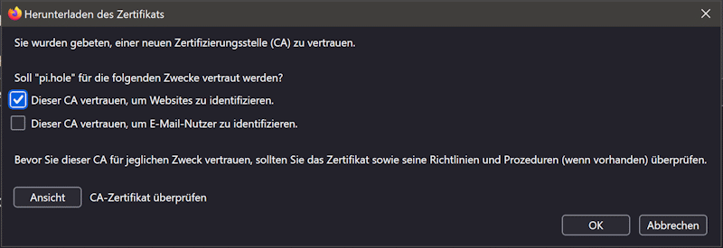
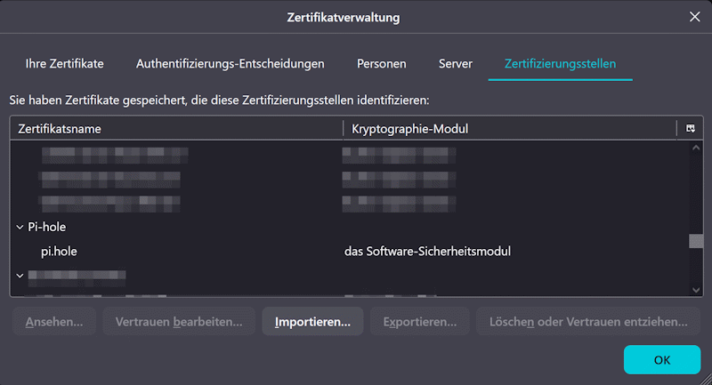

# Secure Socket Layer (SSL)

**Transport Layer Security** (TLS), formerly **Secure Socket Layer** (SSL), is used to encrypt the data which is transported over an insecure channel, as well as make sure that the data can not be tampered with.

To create a connection over SSL, certificates need to be exchanged and verified (from one endpoint or both). Certificates ensure that the connection is secure and can not be manipulated by a third party.[^schutzziele] For this, a cipher suite[^naming-scheme] is negotiated which usually contains

- a **key exchange algorithm**: the symmetric key for encryption is transmitted to the other endpoint via an exchange[^key-exchange]
- an **encryption algorithm**: the actual data is being encrypted so no malicious actor is able to view the data (confidentiality)
- a **message authentication code** (MAC): this ensures via hash validation that the data being sent is not altered by a malicious actor (integrity provided by digital signing)

The cipher suite also mentions which algorithms are used to authenticate the server and/or client.[^authentication]

## Method 1: Create your own Certificate Authority (CA)

By default, Pi-hole provides a self-signed SSL certificate, but you can create your own self-signed certificate that specifies your desired hostname, the fully qualified domain name (FQDN), and the IP address for your Pi-hole server using **OpenSSL**.

The advantage in setting up your own CA is that you can sign certificates for each server and install only one CA certificate (e.g. in your browser) instead of trusting multiple self-signed certificates.

Certificates must be in PEM format containing both the private key and certificate.

If not already present, install OpenSSL:

```sh
sudo apt install openssl
```

It is recommended to keep everything in one place, so create a folder to hold your certificate, config, and key files:

```sh
mkdir -p ~/crt && cd ~/crt
```

It does not matter in which location the certification files are stored, however, it is important that the webserver has access to the files, i.e. that read permissions are correctly set and that the webserver is configured in the right way. In the case of Pi-hole, check the `webserver.tls.cert` setting which links to the server certificate.[^tls-validity]

### Create a Certificate Configuration File (`cert.cnf`)

See the [certificate template](#certificate-template).

### Create a Certificate Authority (CA) Key and Certificate

```sh
openssl req -x509 -newkey ec -pkeyopt ec_paramgen_curve:prime256v1 -noenc -days 3650 -keyout homelabCA.key -out homelabCA.crt -config cert.cnf
```

- `-x509`: Generates a self-signed certificate (for a CA).
- `-newkey ec`: Creates a new EC key.
- `-pkeyopt ec_paramgen_curve:prime256v1`: Uses P-256 curve.[^p-256]
- `-noenc`: Skips password protection (optional).
- `-days 3650`: Valid for 10 years.
- `-keyout homelabCA.key`: Saves the private key.
- `-out homelabCA.crt`: Saves the self-signed CA certificate.
- `-config cert.cnf`: Use configuration file.

The **CA key** (homelabCA.key) and **CA certificate** (homelabCA.crt) are now ready to be used to sign server certificates.

### Generate a Key and CSR for the web server certificate

Use Elliptic Curve Digital Signature Algorithm (ECDSA) to generate both the private key (`tls.key`) and Certificate Signing Request (CSR) (`tls.csr`).

```sh
openssl req -new -newkey ec -pkeyopt ec_paramgen_curve:prime256v1 -noenc -keyout tls.key -out tls.csr -config cert.cnf
```

- `-newkey ec`: Creates a new EC key.
- `-pkeyopt ec_paramgen_curve:prime256v1`: Uses P-256 curve.
- `-noenc` - No password on the private key.
- `-keyout tls.key`: Saves the private key.
- `-out tls.csr`: Saves the certificate signing request (CSR).
- `-config cert.cnf`: Uses the config file for CSR details.

### Sign the CSR with the CA

This generates your server certificate from the CSR.

```sh
openssl x509 -req -in tls.csr -CA homelabCA.crt -CAkey homelabCA.key -CAcreateserial -out tls.crt -days 365 -sha256 -extfile cert.cnf -extensions v3_req
```

- `-req -in tls.csr`: Uses the Certificate Signing Request (CSR) for signing.
- `-CA homelabCA.crt -CAkey homelabCA.key`: Uses our CA to sign the certificate.
- `-CAcreateserial`: Generates a unique serial number.
- `-out tls.crt`: Saves the signed certificate.
- `-days 365`: Valid for 365 days (1 year).
- `-extfile cert.cnf -extensions v3_req`: Includes Subject Alternative Names (SAN)s.

### Create a combined tls.pem File

```sh
cat tls.key tls.crt | tee tls.pem
```

On the Pi-hole server, remove now the existing self-signed certificate files and copy your own `tls.pem` combined certificate to the Pi-hole directory:

```sh
sudo rm /etc/pihole/tls*

sudo cp tls.pem /etc/pihole
```

Pi-hole has by default two certificate files, the root CA certificate is in `/etc/pihole/tls_ca.crt`, and the server certificate in `/etc/pihole/tls.pem`.

### Set file permissions

Make sure that only the required permissions are applied (the certificate needs to be readable by user `pihole`):

```sh
sudo chown pihole:pihole /etc/pihole/tls.pem

sudo chmod 600 /etc/pihole/tls.pem
```

### Restart Pi-hole

```sh
sudo service pihole-FTL restart
```

### Add the CA to the Trusted Root Certificate Store

Install the root certificate on the local computer, so that server certificates signed by this CA will be marked as verified.

Be cautious when adding or removing certificates because it can affect the security and functionality of your system.

Similar like in the following tools, the certificate file content can also be displayed with this command:

```sh
openssl x509 -in certificate.pem -text -noout
```

#### Web browser (Firefox)

Go to `Einstellungen` > `Datenschutz & Sicherheit`. The short link is <about:preferences#privacy>. In this section, either search for or go to the chapter `Zertifikate` and then click on `Zertifikate anzeigen`.

In the menu that appears, click on `Zertifizierungsstellen`. Then click `Importieren` and select the CA certificate. In the next dialogue, choose `Dieser CA vertrauen, um Websites zu identifizieren`.



Now click on `OK` to import the certificate. As the last step verify that the certificate was imported correctly by viewing it in the listing.



<!-- web server certificates will be listed under `Authentifizierungs-Entscheidungen` instead? -->

#### Linux

TODO

#### Windows

The Trusted Root Certification Authorities certificate store contains the root certificates of all CAs that Windows trusts.

To access the Trusted Root Certification Authorities certificate store on a Windows computer, you can use the Microsoft Management Console (MMC) with the Certificates snap-in.

1. Open the Windows Run dialog: Press `Windows key` + `R` to open the Run dialog.
2. Open the Microsoft Management Console (MMC): Type `mmc` into the Run dialog and press `Enter`. This command opens the Microsoft Management Console. If **User Account Control** (UAC) prompts you, select `Yes` to allow the MMC to make changes to your device.
3. Add the certificates snap-in:
  a. In the MMC menu bar, select `Datei` and then select `Snap-in hinzufügen/entfernen`.
  b. In the **Add or Remove Snap-ins** window, scroll down, and select `Zertifikate`, then select `Hinzufügen >`.
  c. A dialog asks which certificates you want to manage. Select `Computerkonto` account, then select `Weiter`.
  d. Select `Lokalen Computer: (Computer, auf dem diese Konsole ausgeführt wird)`, then select `Fertig stellen`.
    - You can also choose My user account or Service account depending on your needs, but for accessing the Trusted Root Certification Authorities, choose Computer account.[^certmgr]
  e. Select `OK` to close **Add or Remove Snap-ins**.
4. Access the Trusted Root Certification Authorities:
  a. In the MMC, select `Zertifikate (Lokaler Computer)`
  b. To add a new certificate, right-click on `Vertrauenswürdige Stammzertifizierungsstellen`. In the context menu, choose `Alle Aufgaben`, then click on `Importieren`. Follow the dialogue menu to finish the process.

<!-- https://learn.microsoft.com/en-us/windows-hardware/drivers/install/trusted-root-certification-authorities-certificate-store -->

### Issuing additional server certificates with your CA (optional)

Now, the created CA can be used to sign new certificates. If the root CA is stored in the browser, these certificates will automatically be recognised as valid.

```sh
# New certificate signing request
openssl req -new -newkey ec -pkeyopt ec_paramgen_curve:prime256v1 -noenc -keyout tls2.key -out tls2.csr -config cert2.cnf

# Sign the new certificate
openssl x509 -req -in tls.csr -CA homelabCA.crt -CAkey homelabCA.key -CAcreateserial -out tls2.crt -days 365 -sha256 -extfile cert2.cnf -extensions v3_req
```

## Method 2: Use a self-signed certificate and manually trust it

This method is simpler than setting up a CA, however, each self-signed certificate must be installed and trusted manually.

For this method, you just need to create a self-signed certificate, similar to how the CA root certificate is created.

After that, you can install the certificate file where you need it.

## Certificate template

Save as `cert.cnf`.

```sh
# Country Name (C)
# Organization Name (O)
# Common Name (CN) - Set this to your server’s hostname or IP address.

# SAN (Subject Alternative Name), [alt-names] is required
# You can add as many hostname and IP entries as you wish

[req]
default_md = sha256
distinguished_name = req_distinguished_name
req_extensions = v3_req
x509_extensions = v3_ca
prompt = no

[req_distinguished_name]
C = US
O = My Homelab
CN = pi.hole

# Used for self-signed certificates
[v3_ca]
subjectAltName = @alt_names
subjectKeyIdentifier = hash
basicConstraints = critical, CA:TRUE
keyUsage = keyCertSign

# Used for certificate signing requests
[v3_req]
subjectAltName = @alt_names
subjectKeyIdentifier = hash
basicConstraints = CA:FALSE
keyUsage = digitalSignature, keyEncipherment, keyAgreement
extendedKeyUsage = serverAuth

[alt_names]
DNS.1 = pi.hole                 # Default pihole hostname
DNS.2 = pihole-test             # Replace with your server's hostname
DNS.3 = pihole-test.home.arpa   # Replace with your server's FQDN
IP.1 = 10.10.10.115             # Replace with your Pi-hole IP
```

*Key* takeaways for setting up a template file:

- The CA root certificate should carry no key usages, except `keyCertSign` and `cRLSign`.

## Links

*TODO: Integrate these in the document.*

General workflow:

- [Lockdown the unencrypted key file via permissions (filesystem ACL)](https://stackoverflow.com/a/23718323)
- [How can I generate a self-signed SSL certificate using OpenSSL?](https://stackoverflow.com/questions/10175812/how-can-i-generate-a-self-signed-ssl-certificate-using-openssl) (several answers with useful input, especially about the parameters to set in the config file)

Creation of the config file:

- [Official example for a config file](https://github.com/openssl/openssl/blob/master/apps/openssl.cnf)
- [openssl docs](https://docs.openssl.org/master/man5/x509v3_config/#standard-extensions)
- [KeyUsage extension](https://superuser.com/questions/738612/openssl-ca-keyusage-extension)
- [Minimal cert config file](https://technotes.shemyak.com/posts/min-openssl-cnf/)
- [Example for a config file](https://github.com/JW0914/Wikis/blob/master/Scripts%2BConfigs/OpenSSL/openssl.cnf)

## References

- This project was mainly inspired by ["Pi-hole v6: Creating Your Own Self-Signed SSL Certificates" by kaczmar2 (2025-02-22)](https://gist.github.com/kaczmar2/e1b5eb635c1a1e792faf36508c5698ee)
- [Create your own Certificate Authority (CA) using OpenSSL](https://arminreiter.com/2022/01/create-your-own-certificate-authority-ca-using-openssl/)

## Annotations

[^schutzziele]: "Schutzziele": [Motivation und Ziele der Informationssicherheit](https://de.wikipedia.org/wiki/Informationssicherheit#Motivation_und_Ziele_der_Informationssicherheit)
[^naming-scheme]: A more detailed explanation on the naming scheme can be found in [Cipher suite § Naming scheme](https://en.wikipedia.org/wiki/Cipher_suite#Naming_scheme)
[^key-exchange]: Examples of this include the Diffie-Hellman-Exchange or the encryption of the symmetric key with a public/private key pair.
[^authentication]: Examples are RSA, Digital Signature Algorithm (DSA) and ECDSA (DSA with elliptic curves). To summarise, RSA can be used both for signing and key exchange, while Diffie-Hellman can only be used to generate a symmetric key for en-/decryption and DSA can only be used for signing.
[^p-256]: P-256 and P-384 are two of the most widely supported key algorithms as of 2025.
[^tls-validity]: At this point, you may also want to check out the `webserver.tls.validity` setting, automatically renewing outdated certificates and potentially overwriting ones that are manually generated.
[^certmgr]: The MMC snap-in for managing certificate displays the global system store. The other options show context specific store, e.g. certificates installed in the user space, similar to [what the certmgr.msc utility does](https://serverfault.com/a/407492).
